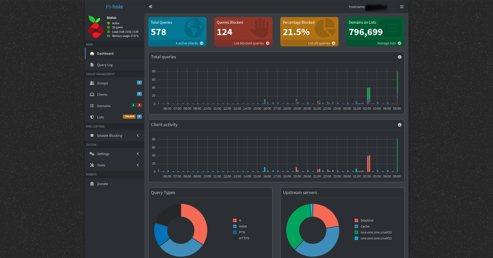
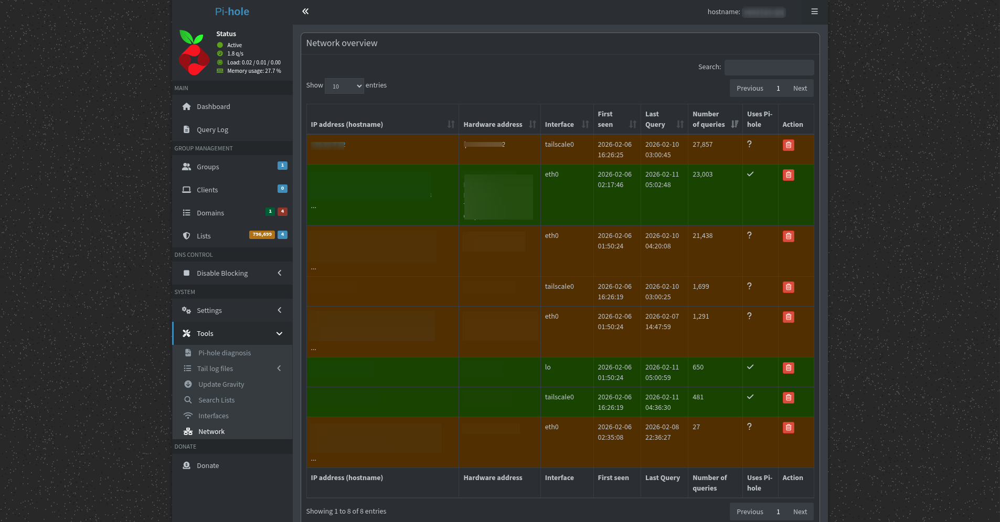
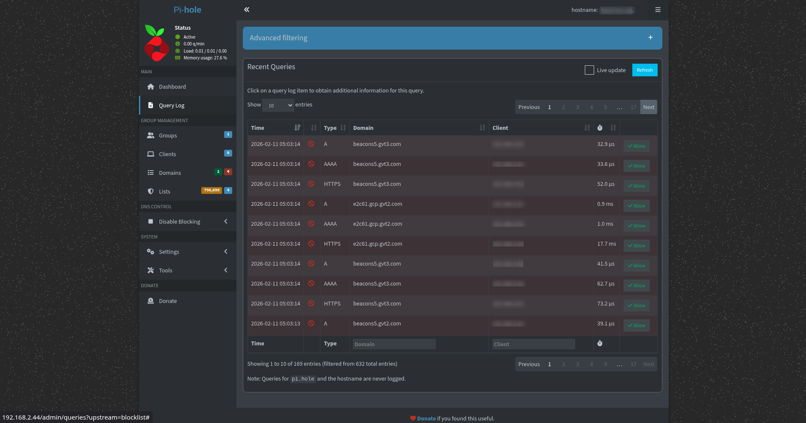

# Persistent Global Ad-Blocking: Pi-hole & Tailscale Integration

## Project Overview
This project implements a network-wide ad-blocking solution using a **Raspberry Pi Zero 2 W**. By integrating **Pi-hole** with **Tailscale**, I created a split-tunnel VPN mesh network that allows my mobile devices to utilize the Pi-hole's DNS filtering even when I am outside my home network (e.g., on 4G/5G or public Wi-Fi).

## Hardware & Software Stack
* **Hardware:** Raspberry Pi Zero 2 W (Chosen for low power consumption).
* **OS:** Raspberry Pi OS Lite (32-bit).
    * *Constraint decision:* The 32-bit Lite version was selected to maximize available RAM (limited to 512MB on the Zero 2 W) by removing the desktop GUI overhead.
* **Core Software:** Pi-hole (DNS Sinkhole), Tailscale (WireGuard-based VPN).
* **Network:** Ethernet connection (via adapter) for reduced latency.

## Configuration Highlights

### 1. Network Setup & Static IP
To ensure consistent DNS resolution, I configured the router to assign a **Static IP** to the Raspberry Pi.
* **DNS Redundancy Strategy:** On client devices, I manually configured both Primary and Secondary DNS fields to the Pi's IP.
    * *Reasoning:* Leaving the Secondary DNS as default (e.g., Google or ISP) allows devices to bypass the blocklist if the Pi is slightly slower to respond. Hard-coding both fields ensures 100% of traffic is filtered.

### 2. Blocklist Expansion
The default installation left some streaming ads through. I expanded the gravity database using community-maintained blocklists from GitHub, significantly increasing the blocked domain count and eliminating persistent pop-ups.

### 3. Remote Access (Tailscale)
To extend protection outside the LAN:
* Installed Tailscale on the Pi and authenticated the machine.
* **Pi-hole Settings:** Enabled *"Permit all origins"* in Interface Settings.
    * *Why:* Tailscale traffic arrives via the `tailscale0` interface, not `eth0`. Pi-hole defaults to local traffic only, so this change was required to accept VPN DNS queries.
* **Tailscale Admin Console:** Enabled "Override Local DNS" and set the Nameserver to the Pi’s Tailscale IP address.

*Above: Network interface analysis confirming active traffic on the `tailscale0` VPN interface alongside the physical `eth0` connection.*
## Troubleshooting & Optimization

During the deployment, I encountered and solved three major specific issues:

### Issue 1: YouTube Thumbnails Blocked
**The Problem:** After adding aggressive blocklists, YouTube video thumbnails stopped loading, appearing as gray boxes.

**The Solution:**
1. Analyzed the Pi-hole `Query Log` during a refresh attempt.
2. Identified that the blocklists were falsely flagging YouTube CDN domains (e.g., `i.ytimg.com`).
3. Manually whitelisted these domains to restore functionality without compromising ad blocking.

### Issue 2: VPN Latency on Wi-Fi
**The Problem:** When connected via Tailscale remotely, browsing felt sluggish.
**The Root Cause:** The Raspberry Pi Zero 2 W's Wi-Fi chip was handling both incoming VPN traffic and outgoing DNS requests, creating a bottleneck.
**The Solution:** Migrated the Pi from Wi-Fi to a hardwired Ethernet connection. This required re-configuring the static IP and updating the Tailscale settings, but resulted in an immediate reduction in latency.

### Issue 3: DNS "Leakage"
**The Problem:** Ads were occasionally appearing despite the Pi being online.
**The Diagnosis:** Devices configured with `Secondary DNS: 8.8.8.8` were bypassing the Pi-hole whenever the Pi took more than a few milliseconds to respond.
**The Solution:** Forced all client DNS requests (Primary and Secondary) to the Pi-hole IP, or `0.0.0.0` for the secondary slot, ensuring no fallback to ad-supported DNS servers.
